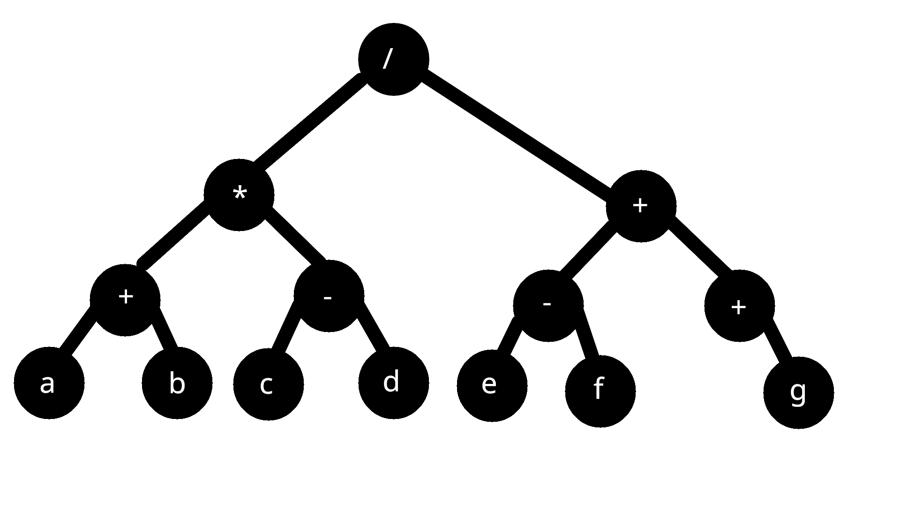
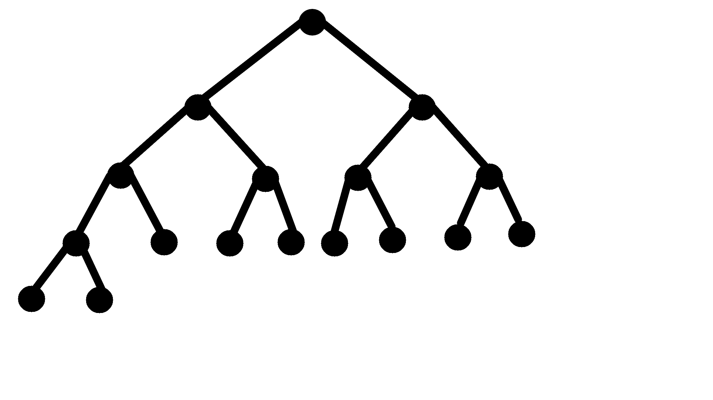
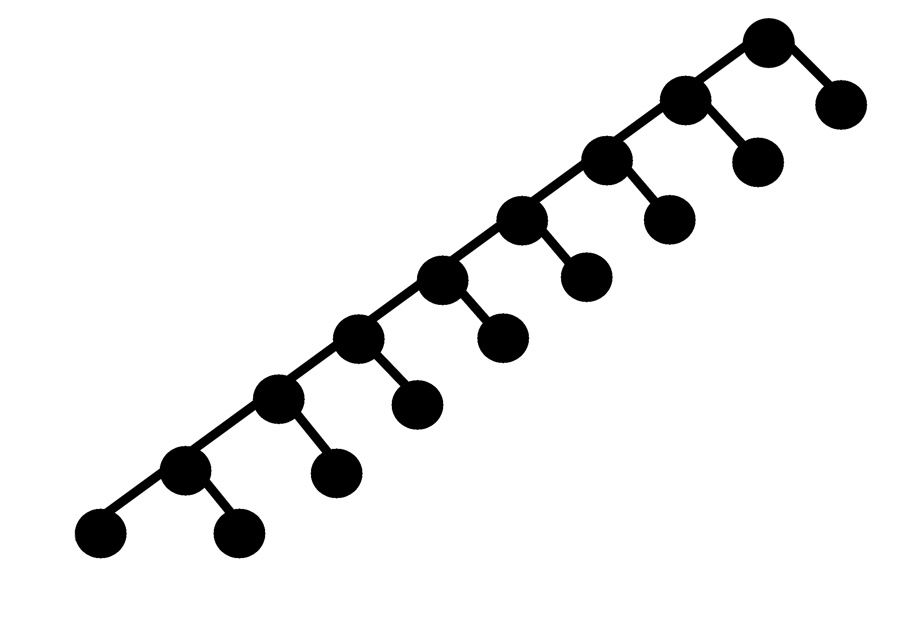

## QUESTÃO 01

1. Uma arvore deve conter em seus NOs um no raiz
2. Apontador para a esquerda da arvore em cada no
3. Apontador para direita da arvore em cada no
4. Cada no deve carregar um conteudo
5. Para ser considerada uma arvore binaria, deve possuir no minimo duas ramificações(n 3)

## QUESTÃO 02

## QUESTÃO 03

<figure>
<figcaption>Menor tamanho possivel</figcaption>

</figure>

<figure>
<figcaption>Maior tamanho possivel</figcaption>

</figure>