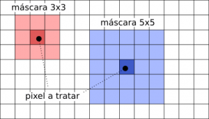
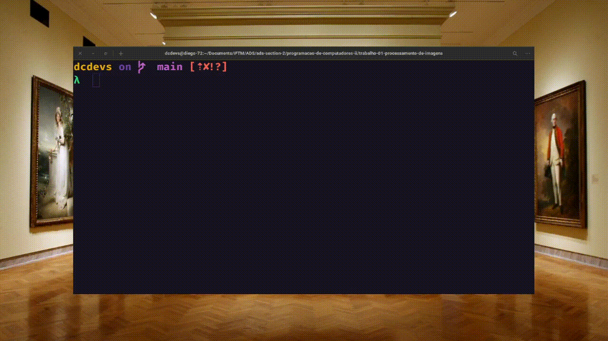
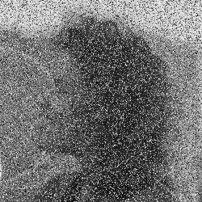

<h2 align="center"> <b>PROCESSAMENTO DE IMAGENS 🖼

</b>FILTRO DE MEDIANA<h2>

## 💬 **Sobre**



<p>O <a href="https://en.wikipedia.org/wiki/Median_filter">Filtro da mediana</a> reduz o nível de ruído de uma imagem sem prejudicar muito sua nitidez. Este filtro consiste basicamente em substituir o valor de um pixel pelo valor da <a href="https://pt.wikipedia.org/wiki/Mediana_%28estat%C3%ADstica%29">mediana</a> de seus pixels vizinhos. O número de vizinhos a considerar é definido por uma máscara, ou seja, a matriz de vizinhos que circunda o pixel a tratar (incluindo ele mesmo):
</p>

<p>O projeto e um <a href="https://pt.wikipedia.org/wiki/Interface_de_linha_de_comandos">CLI</a> onde pode ser aplicado o filtro de mediana pelo  arquivo execultável passando como primeiro argumento, sendo opcional, a mascara do filtro que e um numero inteiro impar, caso ela não seja passada terá como valor padrão 3x3, e como segundo argumento o nome do arquivo de entrada(input), o arquivo deve ser uma imagem no formato <a href="https://en.wikipedia.org/wiki/PGM">.pgm</a></p>
<br>

<div align="center">

</div>

<br>

<div align="center">


</div>

## 💻 **como executar**

```bash
Usage:              pgmmedian  -m N -i input
without mask:       pgmmedian [FILE-INPUT]
with mask:          pgmmedian [ODD-NUMBER-MASK] [FILE-INPUT]
```
---

<h5 align="center">
  &copy;2022 - <a href="https://github.com/dc7devs/">dc7devs</a>
</h5>